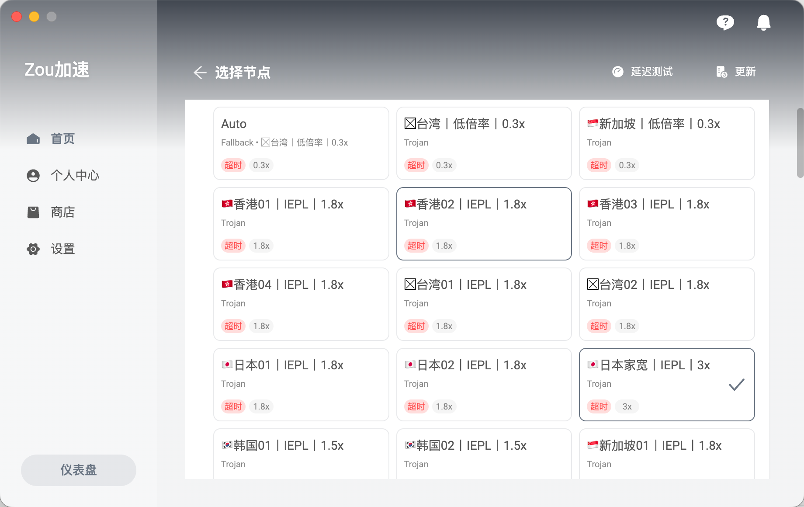

# 公众号 Markdown 排版工作台

一个纯前端静态工具，用来把 Markdown 内容快速排版成适合微信公众号后台粘贴的富文本样式。

## 项目特点

- 无需构建，直接打开即可使用
- 支持多套公众号排版模板切换
- 左侧编辑，右侧实时预览
- 支持复制富文本、复制 HTML、导出 HTML
- 适合写长文、教程、热点解读、知识卡片等内容

## 页面截图



## 快速开始

直接打开 `index.html`，或在项目根目录运行：

```bash
python3 -m http.server 4173
```

然后访问：

```text
http://127.0.0.1:4173
```

## 使用流程

1. 在左侧输入或粘贴 Markdown。
2. 在顶部切换排版模板。
3. 按需调整正文字号、正文行高、容器留白。
4. 在右侧检查预览效果。
5. 点击“复制富文本”，粘贴到公众号后台。

## 支持内容

- 标题、段落、引用
- 粗体、斜体、行内代码
- 无序列表、有序列表
- 分割线、代码块、表格、图片

## 目录说明

- `index.html`：页面入口
- `styles.css`：页面样式
- `app.js`：Markdown 解析、模板渲染、滚动同步、复制逻辑
