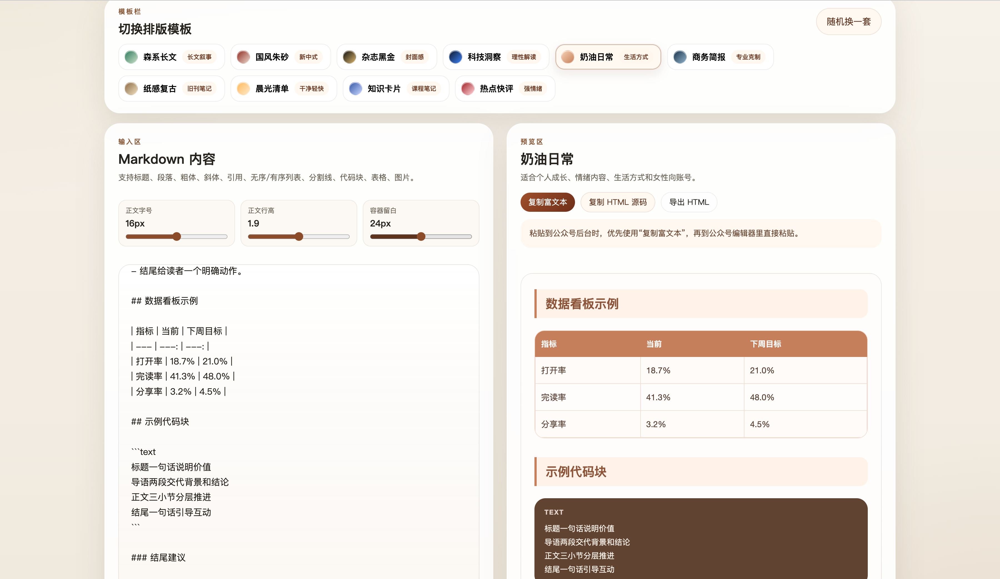

# 公众号 Markdown 排版工作台

一个纯前端静态工具，用来把 Markdown 内容快速转换成适合微信公众号后台粘贴的排版样式。

## 功能概览

- 左侧编写 Markdown，右侧实时预览
- 内置多套公众号模板，可快速切换
- 支持调整正文字号、正文行高、容器留白
- 支持复制富文本、复制 HTML、导出 HTML

## 页面截图



## 快速开始

直接打开 `index.html` 即可使用，或在项目根目录运行：

```bash
python3 -m http.server 4173
```

然后访问 [http://127.0.0.1:4173](http://127.0.0.1:4173)。

## 使用方式

1. 粘贴或输入 Markdown 内容。
2. 选择顶部模板。
3. 调整字号、行高和留白。
4. 检查右侧预览效果。
5. 点击“复制富文本”，直接粘贴到公众号后台。

## 支持内容

- 标题、段落、引用
- 粗体、斜体、行内代码
- 无序列表、有序列表
- 分割线、代码块、表格、图片
